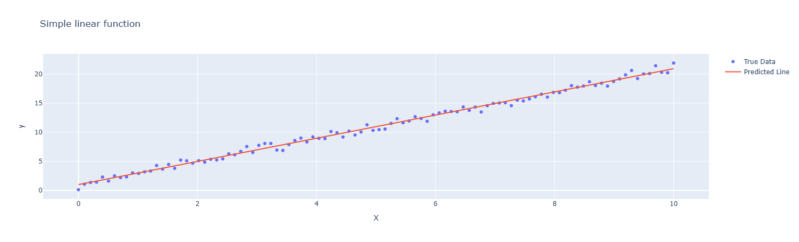
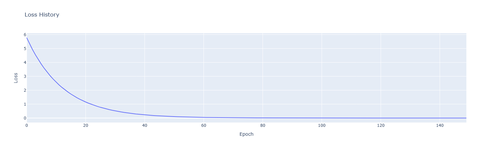
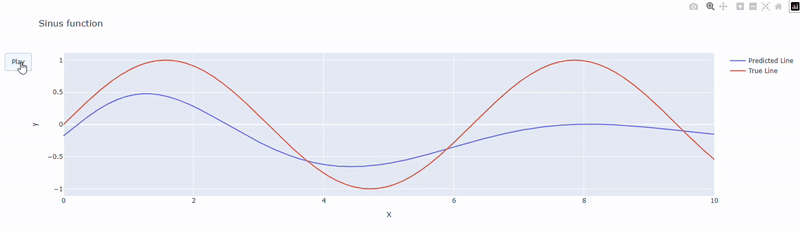
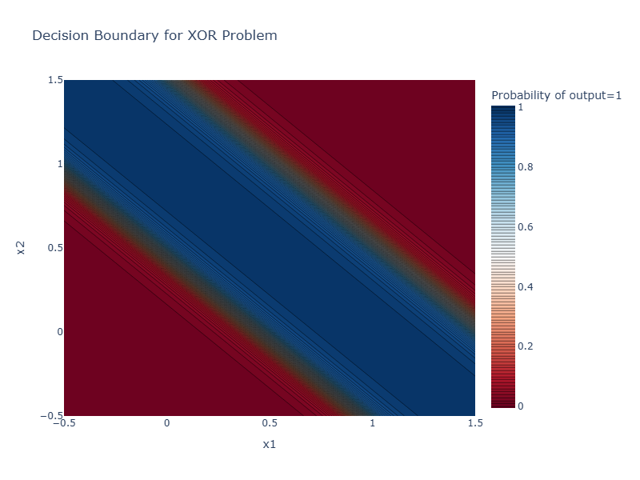

# NeuralNetworkFromScratch
## Presentation
This repository implements a simple Feed Forward Neural Network from scratch using only NumPy.

### Goal
The goal of this project is to understand deep learning components from a mathematical perspective:

- Forward Propagation
- Backward Propagation
- Optimization
- Batching

### Results
The results of the implementation are showcased using four classic problems:
- Simple Linear Regression: $y = a \times x + b$
- Multiple Linear Regression: $y = a_1 \times x_1 + a_2 \times x_2 + b$
- Approximating the Sine Function: $y = sin(x)$
- XOR Problem

## 1- Neural Network
Before defining a neural network, it is necessary to define a [`Layer`](core/network/layer.py) object. It takes a number of neurons `n_neurons` and an activation function defined in the file [activation.py](core/utilities/activation.py).
```
layer = Layer(n_neurons=10, activation="ReLU")
```
The neural network is defined by a class [`NeuralNetwork`](core/network/network.py) that takes as input a list of objects `Layer` and the dimension of the input.
```
network = NeuralNetwork(input_dim=X.shape[1],
                        layers=[Layer(n_neurons=1, activation="identity")])
```

Alternatively, it is possible to define an empty `NeuralNetwork` object and then adding each layer using the `add_layer()` method.

```
network = NeuralNetwork(input_dim=X.shape[1])
network.add_layer(Layer(n_neurons=1, activation="identity"))
```
Before fitting the model, it is important to call the build method, this method initiates the weights matrix and bias vector for each layer.

*NB: The last layer added to the `NeuralNetwork` object is automatically considered the output layer, and each layer before it a hidden layer.*

## 2- Forward Propagation
The `forward()` method on a [NeuralNetwork](core/network/network.py) object does a forward pass using the current weights and biases and takes an array X as input. For each layer "L", it effectively computes its output $A_L$:

$$Z_L = input_L \times W_L + b_L$$
$$A_L = \sigma_L (Z_L)$$

Where, $\sigma_L$ is the layer's activation function, $input_L \in \mathbb{R}^{1 \times m_{L-1}}$ is the output of the previous layer $A_{L-1}$ or the input of the model $X$ if it is the first layer, $W_L \in \mathbb{R}^{m_{L-1} \times m_{L}}$ is the weights matrix, and $b_L \in \mathbb{R}^{1 \times m_{L}}$ the bias vector.

*NB: In the case of multiple observations, we just modify the 1 in the previous expression by N, the number of observations.*

## 3- Backward Propagation

## 4- Optimization

## 5- Batching
Batching is a technique where the input data is separated into chunks of fixed size and fed separately to the model. The smaller data size helps the model learn faster and the variety of the batches makes the model more accurate and generalize better, thanks to the noisier gradients that help the optimization algorithm explore the loss surface better.<br>
Selecting a batch size in the model involves adding it as a model (`batch_size`) parameter during the fitting, it defaults to -1 which takes the whole dataset as a chunk.<br>
Depending on the chosen batch size, different optimization regimes are obtained:
- If `batch_size` is equal to the number of observations, the model uses **Gradient Descent**.
- If `batch_size` is between 1 and the number of observations, the model uses **Mini-batch Gradient Descent**.
- If `batch_size = 1`, the model uses **Stochastic Gradient Descent (SGD)**, where the weights are updated after each individual observation.


## 6- Results
As stated at the beginning, the results are applied on four different classic problems. This [notebook](example/testing_network.ipynb) groups all the results.


### a- Simple Linear Regression
The first example is a sanity check for a simple linear regression with a single 1-neuron layer.

$y = a \times x + b$

```
network = NeuralNetwork(input_dim=X.shape[1])
network.add_layer(Layer(n_neurons=1, activation="identity"))
network.build(loss="MSE")
history = network.fit(X, y, epochs=15, learning_rate=0.1, batch_size=50, verbose=False)
```

The model is able to learn data within 15 epochs. To make the plot more visible, small noise was added on the data.



### b- Multiple Linear Regression
The second example is very similar to the first, it is a multiple linear regression to test the ability of the model to handle multi-dimensional inputs.

$y = a_1 \times x_1 + a_2 \times x_2 + b$




This time, the model converges within 150 epochs and gives the correct results.

```
Weights = [[1.9912418 ]
 [2.99404012]]
 
Bias = [[0.99949735]]
```

### c- Approximating the Sine Function
The third problem is the approximation of the sine function. For this case, a neural network with two hidden layers using a sigmoid activation function is used. The reason behind the activation function is that it is a smooth function, and a weighted sum of sigmoid functions can relatively easily approximate any complex nonlinear functions, such as a sine function. A relatively large network is used to clearly illustrate the convergence.

```
network = NeuralNetwork(input_dim=X.shape[1])
network.add_layer(Layer(n_neurons=256, activation="sigmoid"))
network.add_layer(Layer(n_neurons=256, activation="sigmoid"))
network.add_layer(Layer(n_neurons=1, activation="identity"))
network.build(loss="MSE")
history = network.fit(X, y, epochs=epochs, learning_rate=0.1, batch_size=50, verbose=False)
```

Below is the training progress for the approximation using 10,000 epochs.



### d- XOR Problem
The XOR problem is another classic problem solved by neural networks, it is the gate that activates if and only if one of the two inputs is activated, as such.

| Input 1  | Input 2   |  Output |
|---|---|---|
| 0  | 0  | 0  |
| 0  | 1  | 1  |
| 1  | 0  | 1  |
| 1  | 1  | 0  |

The reason it can be solved by a neural network is because, using two layers, it is possible to create a decision boundary that uses more than one line.
The model, does in fact find the correct decision boundary after around 10,000 epochs.



## 7- References